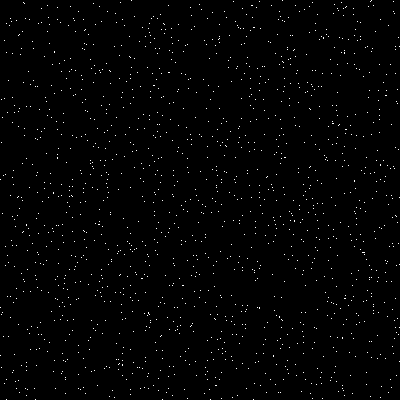
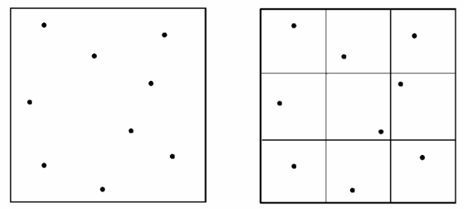
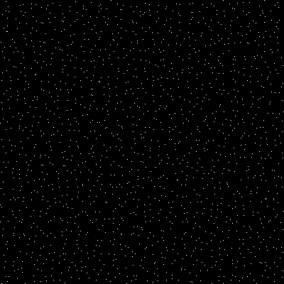
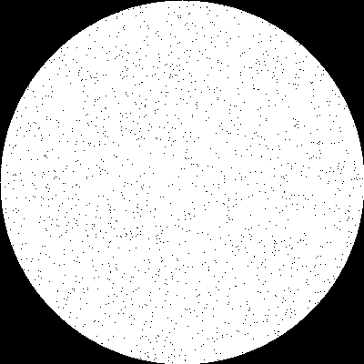
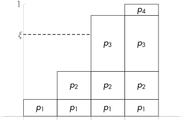
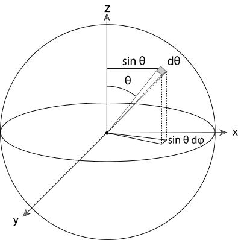
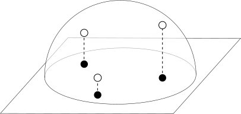

# Ray tracing 中的 sampling

（注：本文基本完全抄袭 [PBRT](http://www.pbr-book.org/3ed-2018/contents.html)）

## 方格子取点

将场景渲染为图像本质上是求解


其中 、 为 2D 图像中的位置，也是发射出的光线的起点。如果 、 只取离散的整数点，那么会由于 sampling rate 过低 ~~导致sampling rate < 2 x 最大频率（Nyquist limit），进而~~ 导致 aliasing。要么通过 prefilter 除掉高频，要么提高 sampling rate。我们通常在每个整数像素对应的格子内多取几个点来发射光线（取点的数量叫做 samples per pixel（SPP））来提高 sampling rate。

但由于上文提到的  在实际场景中最大频率  为  （几何体的边界会有一个值的突变），所以即使增大 sampling rate 也不能完全解决 aliasing 的问题。我们一般在取点时使用非均匀采样，使用一些随机因子，而不只是均匀间隔地取（例如 、 这样每隔  取点），这样 sampling rate 不再固定，也就会减少固定的 aliasing，但是会产生噪音（noise），据说相比之下观感更好。

借助 [pcg-c](https://github.com/imneme/pcg-c)，我们可以生成  范围内的随机数 ：

```cpp
std::uint32_t GenUint32() {
    return pcg32_random_r(&pcg_rand_state_);
}
float GenFloat01() {
    return std::min(ldexp(static_cast<float>(GenUint32()), -32), kOneMinusEpsilon);
}
float Gen1D() {
    return GenFloat01();
}
glm::vec2 Gen2D() {
    return { GenFloat01(), GenFloat01() };
}
```

效果如下：



为了使得生成的点覆盖得更广、更均匀，通常在完全随机的基础上使用 stratified Sampling，即预先将形状均匀分成若干个小格子（strata），在每个小格子内再随机采样，如下图所示。



代码大致如下

```cpp
std::vector<glm::vec2> StratifiedSample2D(int nx, int ny, Sampler& sampler) {
    float dx = 1.0f / nx;
    float dy = 1.0f / ny;
    std::vector<glm::vec2> result(nx * ny);
    for (int j = 0; j < ny; ++j)
    {
        for (int i = 0; i < nx; ++i) 
        {
            result[j * nx + i] = glm::min(
                (glm::vec2{ i, j } + sampler.Gen2D()) * glm::vec2{ dx, dy },
                glm::vec2{ 1.0f, 1.0f });
        }
    }
    return result;
}
```

效果如图



（似乎比刚才更均匀一些（x


## rejection sampling

在正方形中随机取样是挺简单，但是在 ray tracing 中，不仅仅需要在正方形内随机取点。例如使用 Thinlens 相机模型时，需要在 lens （即圆）上随机取点 。最朴素的方法是 rejection sampling：我们先调用在正方形里生成随机点的函数 `Sampler::Gen2D`，如果生成的点不在圆内，就再次调用 `Sampler::Gen2D`，直到生成的点在圆内。代码如下：

```cpp
glm::vec2 RejectionSampleDisk(Sampler& sampler) {
    glm::vec2 p;
    do {
        p = 2.0f * sampler.Gen2D() - glm::vec2{ 1.0f, 1.0f };
    } while (glm::length2(p) > 1.0f);
    return p;
}
```




## Monte Carlo

渲染时往往需要使用积分，例如反射等式：


其中， 为在表面上点  出射方向为  的 exitant radiance； 为表面的 BRDF； 为 incident radiance； 为  与表面上点  的法线的夹角。

但是计算机求不了这个积分，所以我们使用 Monte Carlo 来随机取几个变量来模拟取积分：


其中，随机变量的  的 PDF 为  。 的形状越和  相似，那么  就会越接近要求的积分值。所以我们从  找到一个接近其形状的 ，然后按照这个  来取几个变量 。就像上面的等式，我们在选取随机的  时，可能希望  满足


其中， 为选的方向， 为表面上的点与球圆心连成的线与 z 轴的夹角。

总而言之，我们希望能够生成 PDF 为指定的  的随机变量。


## Inversion method

假设我们想分别按 PDF 为 、、、 来采样四个随机变量，我们把它们的 CDF （） 绘制出来，如图所示：


如果我们在  随机取变量 ，在 Y 轴画条线找到第一个有交点的变量，就显而易见地满足了指定的 PDF :



将这个方法扩展到连续的随机变量上为：

- 求指定的 PDF  的 CDF ；
- 求 ；
- 在  上按均匀分布随机取变量 ；
- 求 

但是这只是一维，通常我们需要在二维上工作。如果 、 相互独立并且其 PDF  可以拆分为 ，那么分别按照前面一维的方法操作即可。这里注意！拆出的  一定要满足 

不能拆开怎么办？还有招：

- 计算 marginal（边缘）PDF ；
- 计算 conditional（条件） PDF ；
- 对这俩函数分别采用一维的方法即可。

回到之前要在单位圆上均匀采样的问题。假设我们要取点 ，易得均匀分布的 PDF  。注意这里 、 并不是独立的，所以没法按照上面的办法直接拆。我们把  转换为更常用的 （其中，）

## 变换随机变量

我们已经知道了  ，那  是多少呢？[wikipedia](https://en.wikipedia.org/wiki/Probability_density_function#Vector_to_vector) 告诉我们，有变换前的变量 、 的 PDF 为 ， 的变换 ；将  的变换 ；、 的反函数 、，那么新的 PDF  为


（式子的后半部分为 Jacobian 矩阵的行列式）对于我们这个圆形的例子，； 。开开心心求解一下偏微分可以得到


如果  满足均匀分布，那么可以得到


## 回到圆上采样的问题

、 是妥妥独立的，我们把  拆一下，注意这里要绞尽脑汁拆成满足 。一番思考后拆成 、。分别求解 CDF：


对 CDF 求反，把在  均匀取的独立变量 、 代入，可得


# 立体角的微分

刚才我们说 


那么定义我们要求解的常数 ，则


其 CDF 应满足：


这个积分直接求不太好求，我们一般将其转换为对  的积分，这里再次借用 PBRT 的图：



其中， 就是图中灰色部分的面积。在 、 足够小时，灰色部分是个矩形，求面积只需要乘上俩边长。易见俩边长分别为 、（ 从将球半径投影至平面得到），则


那么将其代入我们刚才想求的式子 ：


则


## Malley’s method 

我们希望在半球表面上取点，使得 。Malley's method 说的是，如果我们能够在圆上均匀取点，将这个点投影到半球表面，那么这样就能满足我们期望的 PDF。



圆上的  在半球里实际上是 ，我们将其变换到 ，即


求解上面那个大式子，求得球面上的 PDF 为：


真巧啊！


## 在三角形中的均匀采样

三角形！渲染中出场率最高的形状。假设该三角形为腰长为 1 的等腰直角三角形，使用重心坐标（barycentric coordinate）来表示要取的点 （其中 ），易得 ，在这里我们有 ，则 。这玩意可不太好拆出来 、，所以我们先求 、：


然后对二者积分


分别求反函数（ 求解反函数时需要解个一元二次方程，去掉不在  范围内的那个解），将 、 代入：


PBRT 多做了一步，它认为可以将  替换为 ，~~但是我觉得不太严谨：替换了之后定义域会包含原来不包含的 ，由于 ，替换完  的范围有微妙的变化~~ 于是最终：


上面提到，假设了该三角形为腰长为 1 的等腰直角三角形，换成普通三角形只是  不同（依赖三角形的面积 ），其它都一样。

（注：PBRT 也提到了为什么不使用先在正方形内均匀取点，再把取到的点“折”到三角形的那边。因为那样会导致离的非常远的采样点（例如  和 ）映射到一个点上，破环了我们上文提到的 stratified Sampling））