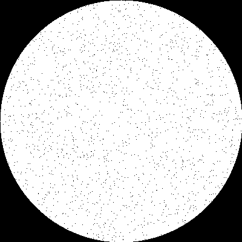
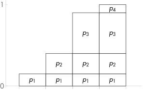
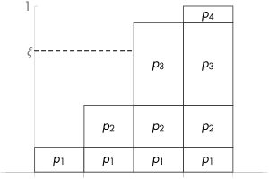
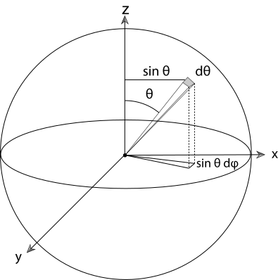

# Ray tracing 中的 sampling

（注：本文基本完全抄袭 [PBRT](http://www.pbr-book.org/3ed-2018/contents.html)）

## 方格子取点

将场景渲染为图像本质上是求解

$$f(x, y, t, u, v, ...) \rightarrow L$$

其中 $x$、$y$ 为 2D 图像中的位置，也是发射出的光线的起点。如果 $x$、$y$ 只取离散的整数点，那么会由于 sampling rate 过低 ~~导致sampling rate < 2 x 最大频率（Nyquist limit），进而~~ 导致 aliasing。要么通过 prefilter 除掉高频，要么提高 sampling rate。我们通常在每个整数像素对应的格子内多取几个点来发射光线（取点的数量叫做 samples per pixel（SPP））来提高 sampling rate。

但由于上文提到的 $f$ 在实际场景中最大频率 $\omega_0$ 为 $\infty$ （几何体的边界会有一个值的突变），所以即使增大 sampling rate 也不能完全解决 aliasing 的问题。我们一般在取点时使用非均匀采样，使用一些随机因子，而不只是均匀间隔地取（例如 $(\frac{1}{4}, \frac{1}{4})$、$(\frac{1}{2}, \frac{1}{4})$ 这样每隔 $\frac{1}{4}$ 取点），这样 sampling rate 不再固定，也就会减少固定的 aliasing，但是会产生噪音（noise），据说相比之下观感更好。

借助 [pcg-c](https://github.com/imneme/pcg-c)，我们可以生成 $[0, 1)$ 范围内的随机数 $\xi$：

```cpp
std::uint32_t GenUint32() {
    return pcg32_random_r(&pcg_rand_state_);
}
float GenFloat01() {
    return std::min(ldexp(static_cast<float>(GenUint32()), -32), kOneMinusEpsilon);
}
float Gen1D() {
    return GenFloat01();
}
glm::vec2 Gen2D() {
    return { GenFloat01(), GenFloat01() };
}
```

效果如下：


为了使得生成的点覆盖得更广、更均匀，通常在完全随机的基础上使用 stratified Sampling，即预先将形状均匀分成若干个小格子（strata），在每个小格子内再随机采样，如下图所示。


代码大致如下

```cpp
std::vector<glm::vec2> StratifiedSample2D(int nx, int ny, Sampler& sampler) {
    float dx = 1.0f / nx;
    float dy = 1.0f / ny;
    std::vector<glm::vec2> result(nx * ny);
    for (int j = 0; j < ny; ++j)
    {
        for (int i = 0; i < nx; ++i) 
        {
            result[j * nx + i] = glm::min(
                (glm::vec2{ i, j } + sampler.Gen2D()) * glm::vec2{ dx, dy },
                glm::vec2{ 1.0f, 1.0f });
        }
    }
    return result;
}
```

效果如图


（似乎比刚才更均匀一些（x


## rejection sampling

在正方形中随机取样是挺简单，但是在 ray tracing 中，不仅仅需要在正方形内随机取点。例如使用 Thinlens 相机模型时，需要在 lens （即圆）上随机取点 $(u, v)$。最朴素的方法是 rejection sampling：我们先调用在正方形里生成随机点的函数 `Sampler::Gen2D`，如果生成的点不在圆内，就再次调用 `Sampler::Gen2D`，直到生成的点在圆内。代码如下：

```cpp
glm::vec2 RejectionSampleDisk(Sampler& sampler) {
    glm::vec2 p;
    do {
        p = 2.0f * sampler.Gen2D() - glm::vec2{ 1.0f, 1.0f };
    } while (glm::length2(p) > 1.0f);
    return p;
}
```




## Monte Carlo

渲染时往往需要使用积分，例如反射等式：

$$ L_o(p, \omega_o) = \int_{S^2} f(p, \omega_o, \omega_i)L_i(p, \omega_i) \cos\theta_i \,d\omega_i $$

其中，$L_o$ 为在表面上点 $p$ 出射方向为 $\omega_o$ 的 exitant radiance；$f$ 为表面的 BRDF；$L_i$ 为 incident radiance；$\theta_i$ 为 $\omega_o$ 与表面上点 $p$ 的法线的夹角。

但是计算机求不了这个积分，所以我们使用 Monte Carlo 来随机取几个变量来模拟取积分：

$$F_N = \frac{1}{N}\int_{i=1}^{N} \frac{f(X_i)}{p(X_i)}$$

其中，随机变量的 $X_i$ 的 PDF 为 $p(X_i)$ 。$p$ 的形状越和 $f$ 相似，那么 $F_N$ 就会越接近要求的积分值。所以我们从 $f$ 找到一个接近其形状的 $p$，然后按照这个 $p$ 来取几个变量 $X_i$。就像上面的等式，我们在选取随机的 $\omega_o$ 时，可能希望 $p(\omega)$ 满足

$$p(\omega) \propto \cos\theta$$

其中，$\omega$ 为选的方向，$\theta$ 为表面上的点与球圆心连成的线与 z 轴的夹角。

总而言之，我们希望能够生成 PDF 为指定的 $p$ 的随机变量。


## Inversion method

假设我们想分别按 PDF 为 $p_1$、$p_2$、$p_3$、$p_4$ 来采样四个随机变量，我们把它们的 CDF （$\sum_{1}^{i} p_i$） 绘制出来，如图所示：



如果我们在 $[0, 1)$ 随机取变量 $\xi$，在 Y 轴画条线找到第一个有交点的变量，就显而易见地满足了指定的 PDF :



将这个方法扩展到连续的随机变量上为：

- 求指定的 PDF $p$ 的 CDF $P(x) = \int_{0}^{x} p(x')\,dx'$；
- 求 $P^{-1}(x)$；
- 在 $[0, 1)$ 上按均匀分布随机取变量 $\xi$；
- 求 $P^{-1}(\xi)$

但是这只是一维，通常我们需要在二维上工作。如果 $x$、$y$ 相互独立并且其 PDF $p(x, y)$ 可以拆分为 $p_x(x)p_y(y)$，那么分别按照前面一维的方法操作即可。这里注意！拆出的 $p_x(x)$ 一定要满足 $\int p_x(x)\,dx=1$

不能拆开怎么办？还有招：

- 计算 marginal（边缘）PDF $p(x) = \int{p(x, y)}\,dy$；
- 计算 conditional（条件） PDF $p(y|x) = \frac{p(x, y)}{p(x)}$；
- 对这俩函数分别采用一维的方法即可。

回到之前要在单位圆上均匀采样的问题。假设我们要取点 $(x, y)$，易得均匀分布的 PDF $p(x, y) = \frac{1}{\pi}$ 。注意这里 $x$、$y$ 并不是独立的，所以没法按照上面的办法直接拆。我们把 $p(x, y)$ 转换为更常用的 $p(r, \theta)$（其中，$r\in[0, 1), \theta\in[0, 2\pi)$）

## 变换随机变量

我们已经知道了 $p(x, y) = \frac{1}{\pi}$ ，那 $p(r, \theta)$ 是多少呢？[wikipedia](https://en.wikipedia.org/wiki/Probability_density_function#Vector_to_vector) 告诉我们，有变换前的变量 $x_1$、$x_2$ 的 PDF 为 $f$，$x_1$ 的变换 $y_1=H_1(x_1, x_2)$；将 $x_2$ 的变换 $y_2=H_2(x_1, x_2)$；$H_1$、$H_2$ 的反函数 $x_1 = H_1^{-1}(y_1, y_2)$、$x_2 = H_2^{-1}(y_1, y_2)$，那么新的 PDF $g(y_1, y_2)$ 为

$$ g(y_1,y_2) = f_{X_1,X_2}\big(H_1^{-1}(y_1,y_2), H_2^{-1}(y_1,y_2)\big) \left\vert \frac{\partial H_1^{-1}}{\partial y_1} \frac{\partial H_2^{-1}}{\partial y_2} - \frac{\partial H_1^{-1}}{\partial y_2} \frac{\partial H_2^{-1}}{\partial y_1} \right\vert $$


（式子的后半部分为 Jacobian 矩阵的行列式）对于我们这个圆形的例子，$x = H_1^{-1}(p, \theta) = r\cos\theta$；$y = H_2^{-1}(p, \theta) = r\sin\theta$ 。开开心心求解一下偏微分可以得到

$$p(r, \theta) = rp(x, y)$$

如果 $(x, y)$ 满足均匀分布，那么可以得到

$$p(r, \theta) = \frac{r}{\pi}$$

## 回到圆上采样的问题

$r$、$\theta$ 是妥妥独立的，我们把 $p(r, \theta) = \frac{r}{\pi}$ 拆一下，注意这里要绞尽脑汁拆成满足 $\int_{0}^{1} p_r(r')dr' = 1$。一番思考后拆成 $p_r(r) = 2r$、$p_{\theta}(\theta) = \frac{1}{2\pi}$。分别求解 CDF：

$$P_r{r} = \int_{0}^{r} r'\,dr' = r^2$$
$$P_\theta{\theta} = \int_{0}^{\theta} \theta'\,d\theta' = \frac{\theta}{2\pi}$$

对 CDF 求反，把在 $[0, 1)$ 均匀取的独立变量 $\xi_1$、$\xi_2$ 代入，可得

$$r = \sqrt{\xi_1}$$
$$\theta = 2\pi\xi_2$$


# 立体角的微分

刚才我们说 

$$p(\omega) \propto \cos\theta$$

那么定义我们要求解的常数 $c$，则

$$p(\omega) = c\cos\theta$$

其 CDF 应满足：

$$\int_{H^2}c\cos\theta\,d\omega = 1$$

这个积分直接求不太好求，我们一般将其转换为对 $(\theta, \phi)$ 的积分，这里再次借用 PBRT 的图：



其中，$\,d\omega$ 就是图中灰色部分的面积。在 $\,d\theta$、$\,d\phi$ 足够小时，灰色部分是个矩形，求面积只需要乘上俩边长。易见俩边长分别为 $\,d\theta$、$\sin\theta\,d\phi$（$\sin\theta$ 从将球半径投影至平面得到），则

$$ \,d\omega = \sin\theta\,d\theta\,d\phi$$

那么将其代入我们刚才想求的式子 $\int_{H^2}c\cos\theta\,d\omega = 1$：

$$\int_0^{2\pi} \int_0^{\frac{\pi}{2}} c\cos\theta\sin\theta\,d\theta\,d\phi = 1$$
$$\int_0^{2\pi} \int_0^{\frac{\pi}{2}} \cos\theta\sin\theta\,d\theta\,d\phi = \frac{1}{c}$$
$$\int_0^{2\pi}\frac{1}{2}\,d\phi = \frac{1}{c}$$
$$c = \frac{1}{\pi}$$

则

$$p(\theta,\phi) = \frac{\cos\theta\sin\theta}{\pi}$$

## Malley’s method 

我们希望在半球表面上取点，使得 $p(\theta,\phi) = \frac{\cos\theta\sin\theta}{\pi}$。Malley's method 说的是，如果我们能够在圆上均匀取点，将这个点投影到半球表面，那么这样就能满足我们期望的 PDF。


圆上的 $(r, \theta)$ 在半球里实际上是 $(\sin\theta, \phi)$，我们将其变换到 $(\theta, \phi)$，即

$$H_1^{-1}(x_1, x_2) = \sin{x_{1}}$$
$$H_2^{-1}(x_1, x_2) = x_2$$
$$f_{X_1, X_2} = \frac{X_1}{\pi}$$

求解上面那个大式子，求得球面上的 PDF 为：

$$g(\theta, \phi) = \frac{\cos\theta\sin\theta}{\pi}$$

真巧啊！


## 在三角形中的均匀采样

三角形！渲染中出场率最高的形状。假设该三角形为腰长为 1 的等腰直角三角形，使用重心坐标（barycentric coordinate）来表示要取的点 $(u, v)$（其中 $u \in (0, 1),v \in (0, 1 - u)$），易得 $p(u, v) = \frac{1}{S}$，在这里我们有 $S = \frac{1}{2}$，则 $p(u, v) = 2$。这玩意可不太好拆出来 $p_u$、$p_v$，所以我们先求 $p(u)$、$p(v | u)$：

$$p(u) = \int_{0}^{1 - u}2\,dv = 2(1 - u)$$
$$p(v | u) = \frac{p(u, v)}{p(u)} = \frac{2}{2(1 - u)} = \frac{1}{1 - u}$$

然后对二者积分

$$P_u(u) = \int_{0}^{u}2(1 - u')\,du' = 2u - u^2$$
$$P_v(v) = \int_{0}^{v}p(v'|u) = \int_{0}^{v}\frac{1}{1 - u}\,dv' = \frac{v}{1 - u} $$

分别求反函数（$P_u$ 求解反函数时需要解个一元二次方程，去掉不在 $(0, 1)$ 范围内的那个解），将 $\xi_1$、$\xi_2$ 代入：

$$ u = 1 - \sqrt{1 - \xi_1} $$
$$ v = \sqrt{1 - \xi_1}\xi_2 $$

PBRT 多做了一步，它认为可以将 $1 - \xi$ 替换为 $\xi$，~~但是我觉得不太严谨：替换了之后定义域会包含原来不包含的 $1$，由于 $\xi \in [0, 1)$，替换完 $u$ 的范围有微妙的变化~~ 于是最终：

$$ u = 1 - \sqrt{\xi_1} $$
$$ v = \sqrt{\xi_1}\xi_2 $$

上面提到，假设了该三角形为腰长为 1 的等腰直角三角形，换成普通三角形只是 $p(u, v)$ 不同（依赖三角形的面积 $S$），其它都一样。

（注：PBRT 也提到了为什么不使用先在正方形内均匀取点，再把取到的点“折”到三角形的那边。因为那样会导致离的非常远的采样点（例如 $(0.01, 0,01)$ 和 $(0.99, 0.99)$）映射到一个点上，破环了我们上文提到的 stratified Sampling））